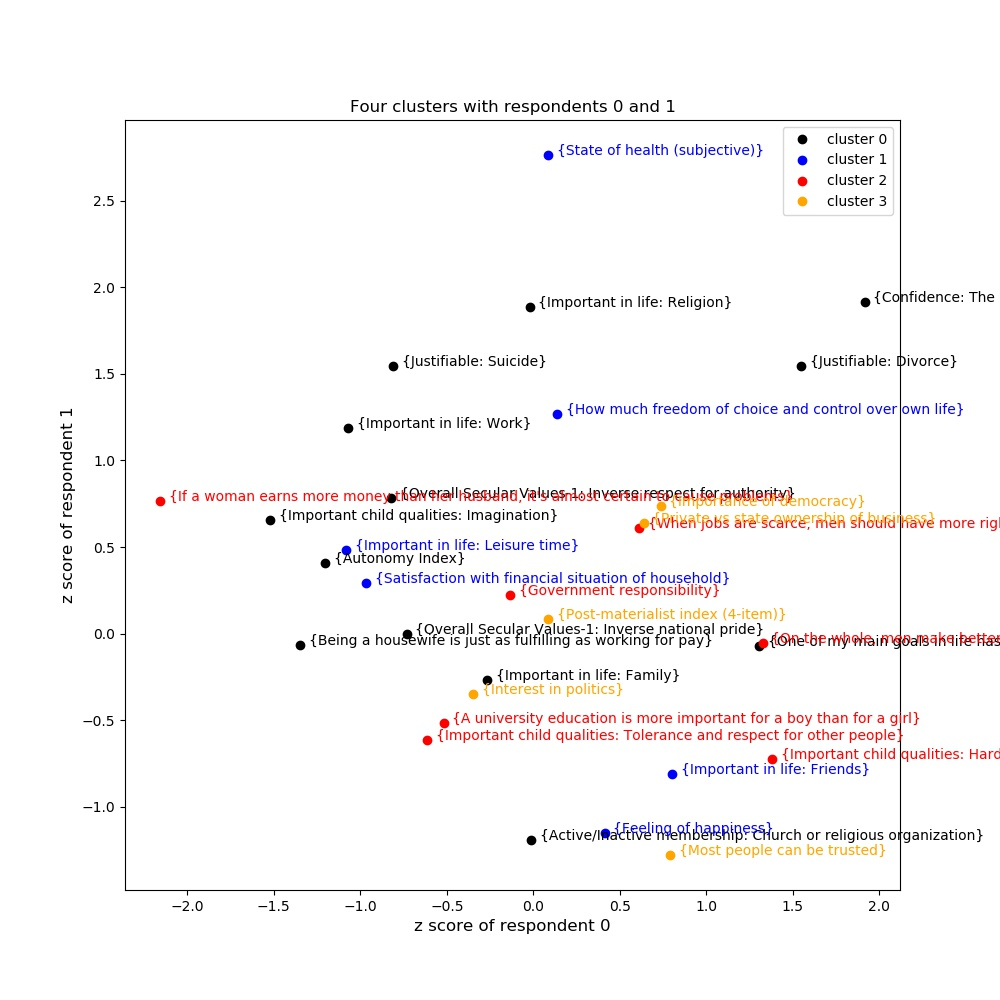
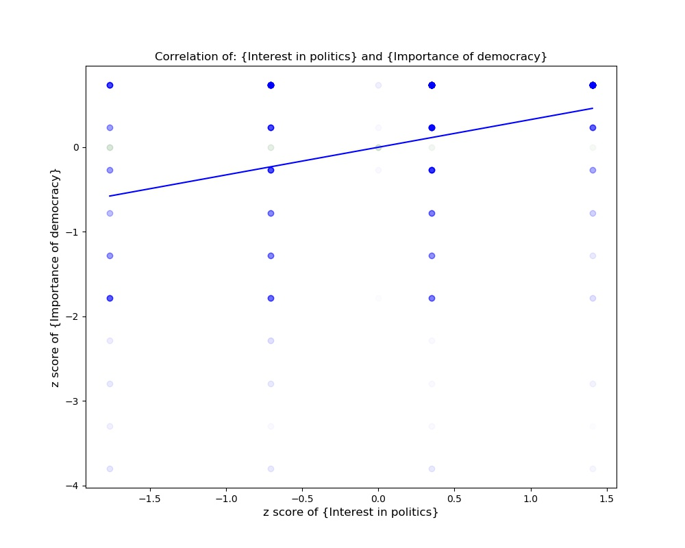

## Modernization and democracy

This project is based on work by political scientists Ronald Inglehart and Christian Welzel.  They were interested in understanding how to promote democracy throughout the world.  They create a survey called the "World Values Survey" to understand this topic better.

Based on the survey, Inglehart proposed that democracy will come with material wealth: as people become wealthier, they can afford to be more tolerant, for example.  Inglehart is so confident of this claim that he sometimes writes as if democracy and wealth are the same thing.

## My hypothesis

I was somewhat skeptical of this claim.  I believe Inglehart when he says that democracy and wealth are related to some degree, but on the other hand, American democracy dates back to the late 1700s when America was quite poor.  This suggests that wealth and democracy may in some cases be quite unrelated.  I decided to check Inglehart's data, available on:

http://www.worldvaluessurvey.org/wvs.jsp

In particular, I used the "Wave 6: 2010-2014" data located at:

http://www.worldvaluessurvey.org/WVSDocumentationWV6.jsp

My goal was to take Inglehart's survey items and to try to cluster them into two clusters as well as four clusters, to see what would be related to the respondents' interest in democracy.  I hypothesized that when there are four clusters, the material wealth survey items would come out in a different cluster than belief in the importance of democracy.

In addition, Inglehart himself has done a cluster analysis of sorts, and reported the two clusters he found in his book.  I was interested in finding out whether I could reproduce his two clusters.

## Data

I analyzed data at the level of the United States (about 2,000 respondents) and at the level of the whole world (about 90,000 respondents).  Figure 1 shows a selection of 31 survey items that Inglehart thought were especially important.  I have selected two United States respondents so that the picture is two dimensional: on the x-axis, I have plotted the z-score for respondent 0's answer and on the y-axis, the z-score for respondent 1's answer.  Each point represents one survey item.  The four clusters are shown in four different colors (see legend).  However, from Figure 1 alone the clusters don't seem right.  They overlap a great deal.  That's because we are only looking at two respondents.  In the true problem space, which is 2,000-dimensional, the clusters would be apparent; however, this space cannot be visualized directly.



Figure 1: respondent 0 vs. respondent 1

Another way to visualize the data is to view the correlation between two survey items (Figure 2).  In Figure 2, the opacity of each dot indicates the number of respondents at that point.  Since the survey was discrete, the dots form a discrete lattice.  "Interest in politics" could be answered on a 4-point scale and "Importance of democracy" on a 10-point scale.  From this picture, we can see that the two are correlated, and the line of best fit is plotted.  In the United States, people who are very interested in politics tend to believe that democracy is very important.



Figure 2: survey item {Importance of democracy} vs. {Interest in politics}

## Clustering analysis

I used a clustering analysis method called Affinity Propagation from the scikit-learn library.  This method allowed me to create a custom metric to ensure that any two survey items would be grouped together even if their answer orders were reversed.  For example, the "Importance of Democracy" item has 1 = least important and 10 = most important, while the "Interest in Politics" item has 1 = most important and 4 = least.  Ensuring that these items would be matched took some care.

I analyzed data at the level of the United States (about 2,000 respondents) and at the level of the whole world (about 90,000 respondents.)

## Results

The result confirmed my suspicion.  When splitting the clusters into four, it was clear that the respondent's satisfaction with their financial situation was not grouped with democracy.  The items grouped with the wealth issue were mostly apolitical.

The items in this "apolitical / financial" cluster were:
* {Satisfaction with financial situation of household}
* {Important in life: Friends}
* {Important in life: Leisure time}
* {Feeling of happiness}
* {State of health (subjective)}
* {How much freedom of choice and control over own life}

The items clustered with "democracy" were:

* {Importance of democracy}
* {Most people can be trusted}
* {Interest in politics}
* {Private vs state ownership of business}
* {Post-materialist index (4-item)}

Thus, people in the United States were more likely to approve of democracy if they were trusting, interested in politics, and approved of state ownership of business.

At a global scale, the items related to democracy were quite different.  (All of these were actually inversely related to democracy, apart for the democracy item itself.)  These items were:

* {Importance of democracy}
* {Would not like to have as neighbors: Immigrants/foreign workers}
* {When jobs are scarce, men should have more right to a job than women}
* {If a woman earns more money than her husband, it's almost certain to cause problems}
* {On the whole, men make better political leaders than women do}
* {A university education is more important for a boy than for a girl}
* {Being a housewife is just as fulfilling as working for pay}
* {Political system: Having a strong leader who does not have to bother with parliament and elections}

Thus, it seems that more modern views about women's roles are especially common in democratic countries.

## Extended printout

The following is the complete printout of the results for the four-cluster analysis of the United States.  An explanation of the output format is given within the output itself.

```
The number of good survey items for the United States is:  31
The number of respondents for the United States is:  2232
How to interpret these resuls:

Clustering was performed by Affinity Propagation.
The number 0, 1, 2, or 3 is the cluster number.  All 0's are in the same cluster.
Surv-Exp means that this item is classified as Survival vs. Self-Expression by Inglehart.
Trad-Sec means that this item is classified as Traditional vs. Secular by Inglehart.
The phrase in brackets { } describes the nature of the item.

A's are correlated with other A's and anticorrelated with B's in that cluster.
However, to interpret this you need to know whether the scale on that item runs from e.g.
1 (highest) to 5 (lowest) or the reverse.  This requires manually consulting a table.

A (0, 'Trad-Sec', '{Important in life: Family}')
A (0, 'Trad-Sec', '{Important in life: Work}')
A (0, 'Trad-Sec', '{Important in life: Religion}')
B (0, 'Surv-Exp', '{Important child qualities: Imagination}')
B (0, 'Trad-Sec', '{Active/Inactive membership: Church or religious organization}')
A (0, 'Trad-Sec', '{One of my main goals in life has been to make my parents proud}')
A (0, 'Surv-Exp', '{Being a housewife is just as fulfilling as working for pay}')
A (0, 'Trad-Sec', '{Confidence: The Churches}')
A (0, 'Trad-Sec', '{Justifiable: Divorce}')
A (0, 'Trad-Sec', '{Justifiable: Suicide}')
A (0, 'Trad-Sec', '{Autonomy Index}')
A (0, 'Trad-Sec', '{Overall Secular Values-1: Inverse respect for authority}')
A (0, 'Trad-Sec', '{Overall Secular Values-1: Inverse national pride}')
A (1, 'Surv-Exp', '{Important in life: Friends}')
A (1, 'Surv-Exp', '{Important in life: Leisure time}')
A (1, 'Surv-Exp', '{Feeling of happiness}')
A (1, 'Surv-Exp', '{State of health (subjective)}')
B (1, 'Surv-Exp', '{How much freedom of choice and control over own life}')
B (1, 'Surv-Exp', '{Satisfaction with financial situation of household}')
B (2, 'Surv-Exp', '{Important child qualities: Hard work}')
A (2, 'Surv-Exp', '{Important child qualities: Tolerance and respect for other people}')
B (2, 'Surv-Exp', '{When jobs are scarce, men should have more right to a job than women}')
B (2, 'Trad-Sec', "{If a woman earns more money than her husband, it's almost certain to cause problems}")
B (2, 'Surv-Exp', '{On the whole, men make better political leaders than women do}')
B (2, 'Surv-Exp', '{A university education is more important for a boy than for a girl}')
A (2, 'Surv-Exp', '{Government responsibility}')
A (3, 'Surv-Exp', '{Most people can be trusted}')
A (3, 'Trad-Sec', '{Interest in politics}')
A (3, 'Surv-Exp', '{Private vs state ownership of business}')
B (3, 'Surv-Exp', '{Importance of democracy}')
B (3, 'Surv-Exp', '{Post-materialist index (4-item)}')
```
